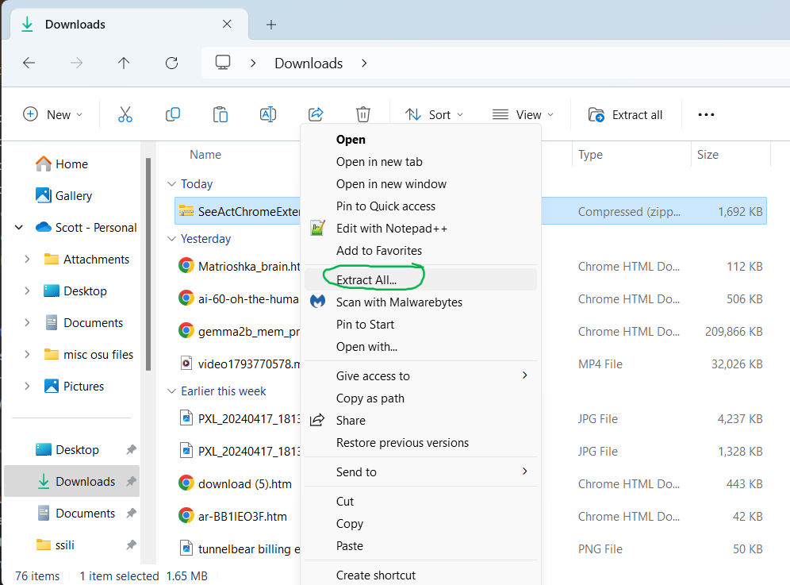
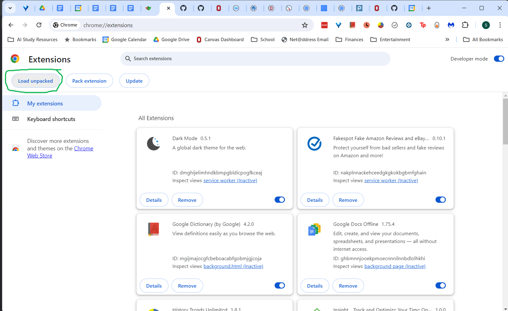
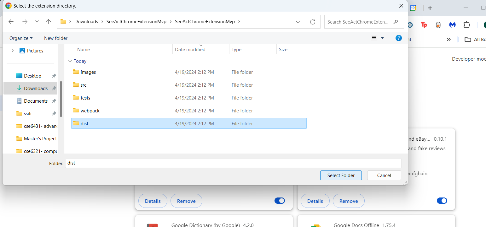
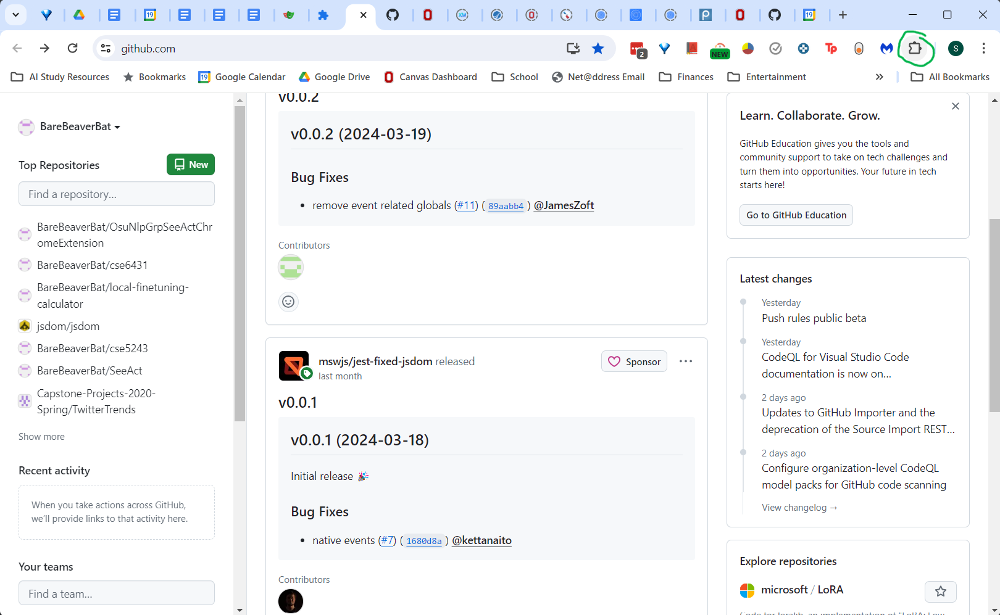
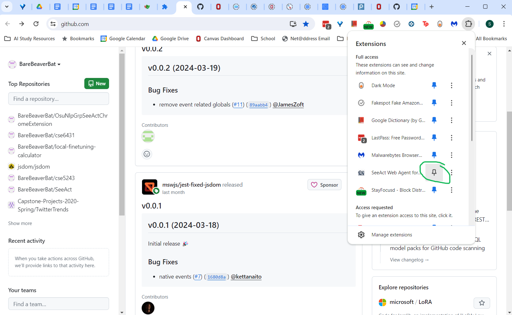
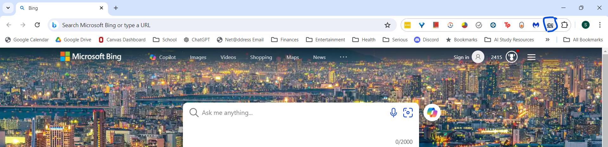
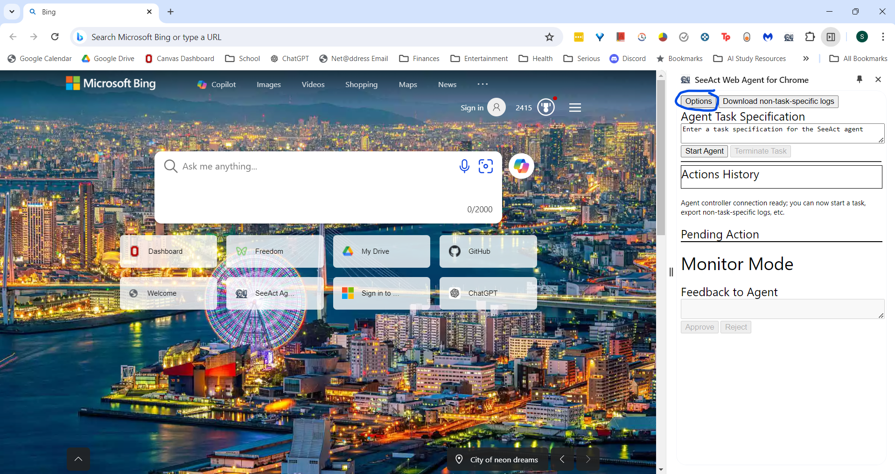
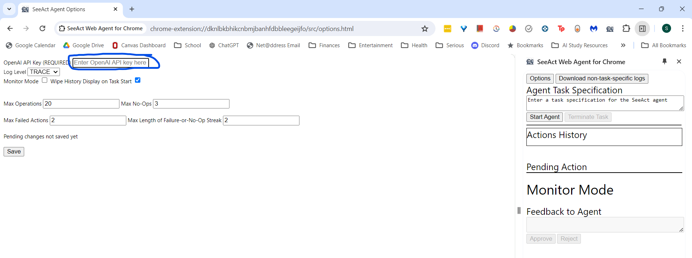
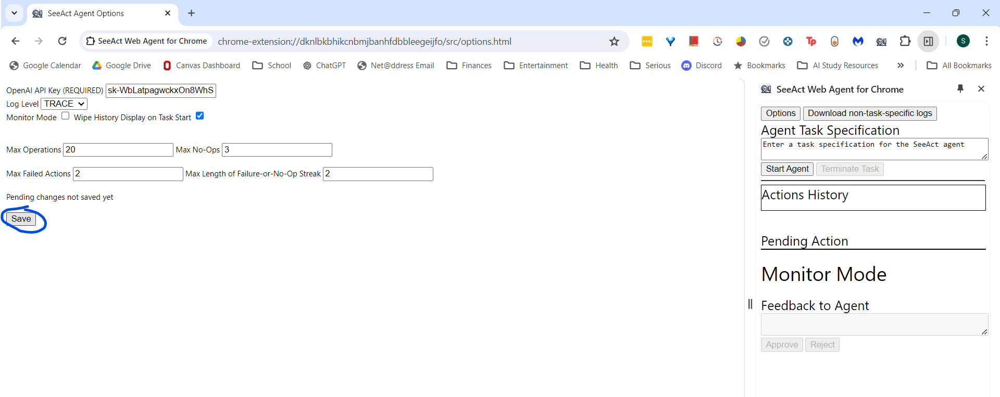
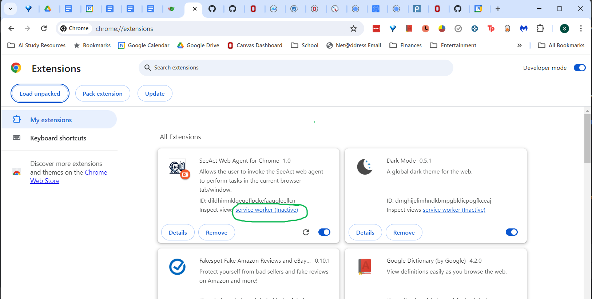

# OsuNlpGrpSeeActChromeExtension

Chrome extension to allow end-users to leverage the logic/behavior of the Python code in the SeeAct repository (i.e.
just installing a chrome extension from chrome web store rather than having to install python and playwright locally and
then download/run SeeAct). It also allows them to use their own login sessions (since it runs in their existing Chrome
window/tab rather than in a separate/playwright-created browser window).

TODO before chrome-web-store submission: copy the user_manual.md, privacy_policy.pdf, and rail_a_eula.pdf files 
  to a chrome_extension folder in the main branch of OSU-NLP-Group/SeeAct repo

# Setup

The zip of this repo included the dist folder for ease of installing the built extension. However, the zip omits the 
node_modules folder as it's irrelevant for quick installation.

The below installation instructions err on the side of excessive detail on the theory that people for whom this is excessive
can probably figure out most of the installation process without this guide.

Once you have extracted the contents of the repo, please follow these steps to load the extension into Chrome:
1. Open a new tab in Chrome.
2. Enter "chrome://extensions" in the address bar and press enter.
3. Ensure that the "Developer mode" switch in the upper right corner is turned on.
4. Click the "Load unpacked" button.

5. Navigate to the dist folder in the extracted contents of the repo, and click the "Select Folder" button.

6. Switch to another tab and click on the "Extensions" puzzle-piece icon near upper right corner of window

7. Click the pin icon next to the "SeeAct Web Agent for Chrome" extension to make its icon show up in the browser's upper right corner. 

8. Click the extension's icon (robot next to monitor) to open the extension's side-panel.

9. Open the Options menu by clicking the button with that name in upper left corner of the side panel

10. Enter your API key for the OpenAI API so that the extension's web agent can run on GPT-4 models.

11. Save the options changes with the "Save" button

# Usage
Most UI elements (in side panel and options menu) have more explanation of their purpose and behavior in the form of
tooltips that appear when hovering over the elements' labels.

Also, text blocks in the side panel (under "Action History" or "Pending Action" headings, plus some of the temporary status messages that appear just above the "Pending Action" section) 
will have tooltips with more detail when you hover over them.

## Opening the Extension's DevTools Window
This is needed for real-time viewing of logs but is no longer necessary for most use cases because logging is stored and automatically-exported (in the case of a task's logging) or easy-to-export (in the case of non-task-specific logging)

1. Open a new tab in Chrome.
2. Enter "chrome://extensions" in the address bar and press enter.
3. Find the "SeeAct Web Agent for Chrome" extension in the list of extensions.
4. There will be a line "Inspect views: service worker"; with the "service worker" part being a link. Click that link.

TODO? add updated screenshots that reflect side-panel-based ui
## Starting a Task
1. To ensure that the browser's focus is in the appropriate tab, please click somewhere in the tab which you want the 
agent to act in, just before starting a task.
2. Click the extension's icon (robot next to monitor) to open the extension's side-panel.
3. Type a task description into the "Task Specification" text box and click the "Start Task" button.  

Please be sure not to click anything outside the web agent's window/tab while a task is running, as this
will cause an error and the task will be terminated.

## Terminating a Task
If the agent does something undesirable, becomes stuck in a loop, goes in a non-viable direction, etc.,
you can terminate the task by clicking the "Terminate Task" button in the side panel. This will ensure that the agent
does not initiate any further actions in the current task (including when it is partway through planning a next action).

## Hover Action
In order for the agent to be able to perform a hover action, the user's actual mouse cursor must be moved outside the
bounds of the window which the web agent is operating in, immediately after the "start task" button had been clicked 
in the extension's side panel. Alternatively, the user's actual cursor can be kept in the side panel in the current window.

## Logs
For a given task, almost all of the logs related to it will have been associated with its task id and will be automatically
exported upon task termination (whether by task-completion, error, or user intervention) to a zip file in the downloads folder (along with screenshots and a few summary json files about the task).

However, logs related to the options menu will only be accessible by clicking the "Download misc logs" button near the bottom right corner of the side panel.

Also, more troublesomely, a handful of the first logs that're conceptually/temporally related to a task and several of the last logs that're conceptually/temporally related to a task will not be associated with the task id and will not be exported in that task's zip file. These logs can be found based on timestamp in the "non-task-specific" logs export by clicking the "Export non-task-specific logs" button (in the upper right corner of the side panel) again a bit after the task ended.

# Conventions

## Typescript

Files which export multiple utility methods will have all_lowercase names. Files which export a single main class will 
have PascalCase names.

## Testing

White-box as well as black-box types of unit tests (both using jest).

## Logging

TRACE log level has the same meaning as in java/c#/etc, not the meaning it has in js console.trace() (which prints out 
a stack trace to the calling line of code)

Use WARN for problems from user input or AI model outputs being bad (even if those problems cause task failure)  
Only use ERROR if one of the assumptions/expectations in the extension's design is violated (e.g. unexpected type of 
error, controller is in a particular state at a point in code execution where that shouldn't be possible, etc.)

Some timestamps are higher precision (5 to 100 microseconds precision rather than 1 millisecond precision). They use the
Performance browser API. Please [beware](https://developer.mozilla.org/en-US/docs/Web/API/Performance/now#description) 
possible confusion from system clock adjustments (e.g. DST) or clock skew when comparing high-precision vs normal timestamps.

## Developer notes

TODO consider replacing "utils" folder with frontend, serviceworker, and shared folders

TODO explore use of desktopCapture permission when adding support for voice input during tasks

TODO really need to standardize naming conventions for certain entities at some point (not just variable/enum-entry names but also comments and strings like log messages)
 - agent controller in background script- "Controller"/"AgentController"/"ServiceWorker"/"Background"
 - page actor in content script- "Actor"/"Page"/"PageActor"/"ContentScript"
 - manager in side panel- "SidePanelManager"/"Panel"/"SidePanel"
 - task_history_entry vs action_performed_record  etc.
 - etc.

Open question for chrome.debugger api: how to handle the case where the tab is already being
 debugged by another extension? tell the LLM that it can't use HOVER for now and must try to click instead?
